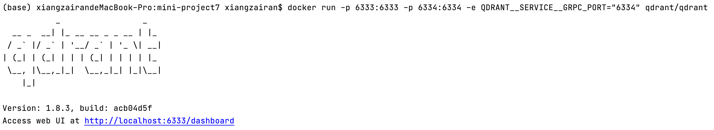
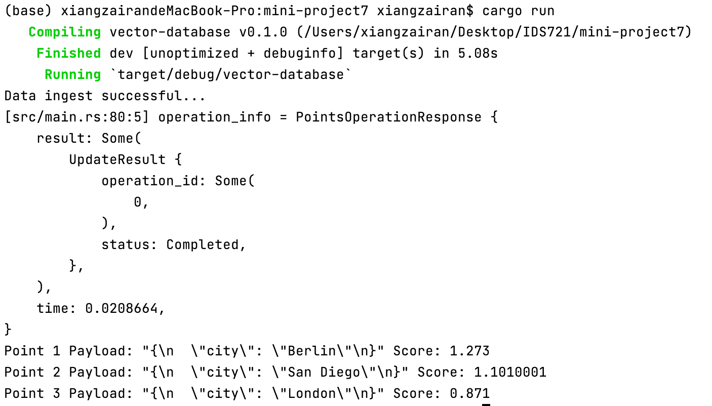

# mini-project7: Data Processing with Vector Database
This project includes features for adding, searching, and visualizing data within Qdrant database. I used Docker commands to initiate a Qdrant container, configuring it to map specific ports. Then I ingested data into Vector database, performed queries and aggregations, and returned the visualized the results after some filters.

Key requirements:
- Ingest data into Vector database
- Perform queries and aggregations
- Visualize output

# Procedures: 
## Download And Run Vector Database [Qdrant](https://qdrant.tech/)
```bash
docker pull qdrant/qdrant
docker run -p 6333:6333 -p 6334:6334 -e QDRANT__SERVICE__GRPC_PORT="6334" qdrant/qdrant
```
the result should looks like below.


## Create A Rust Project
```bash
Cargo new project_name
cd project_name
```
to create a new rust project, then add dependencies to Cargo.toml file in project's root directory.

```toml
[dependencies]
tokio = { version = "1", features = ["full"] }
serde_json = "1.0"
qdrant-client = "1.8.0"
anyhow = "1.0"
```

### Write the main function To perform data processing in src/main.rs

I follow the instructions from this [website](https://qdrant.tech/documentation/quick-start) to create a Collection, load data into it and run a basic search query.

#### Initialize the client
    
```rust
let client = QdrantClient::from_url("http://localhost:6334").build()?;
```

#### Create a Collection
```rust
let collection_name = "test_collection";

client
    .create_collection(&CreateCollection {
        collection_name: collection_name.into(),
        vectors_config: Some(VectorsConfig {
            config: Some(Config::Params(VectorParams {
                size: 4,
                distance: Distance::Dot.into(),
                ..Default::default()
            })),
        }),
        ..Default::default()
    })
    .await?;
```

#### Add a few vectors with a payload
```rust
let points = vec![
    PointStruct::new(
        1,
        vec![0.05, 0.61, 0.76, 0.74],
        json!(
            {"city": "Berlin"}
        )
        .try_into()
        .unwrap(),
    ),
    // ..truncated
];
let operation_info = client
    .upsert_points_blocking("test_collection".to_string(), None, points, None)
    .await?;

println!("Data ingest successful...");

dbg!(operation_info);
```

#### Run a query
```rust
let search_result = client
    .search_points(&SearchPoints {
        collection_name: "test_collection".to_string(),
        vector: vec![0.2, 0.1, 0.9, 0.7],
        limit: 3,
        with_payload: Some(true.into()),
        ..Default::default()
    })
    .await?;
```

#### Visualize the output for each found point
```rust
for (index, point) in search_result.result.iter().enumerate() {
    println!("Point {} Payload: {:?} Score: {}", index + 1, serde_json::to_string_pretty(&point.payload).unwrap(), point.score);
}
```

### Results
